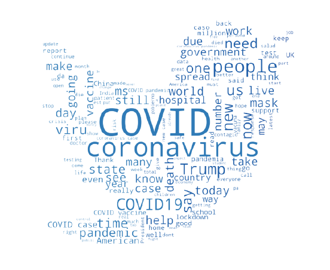

# Ming Qiu
*A Cognitive Science Instructional Assistant and student at UCSD | Machine Learning specialty | Interested in Data Science and Machine Learning field*

# Education
* Bachelors of Science (Cognitive Science Machine Learning specialty), *University of California, San Diego*, 2020-2022
* Associate of Science (Cognitive Science), *Glendale Community College*, 2017-2020

# [Project 1: Sentiment Analysis of COVID-19 on Twitter](https://github.com/MingQiu99/SentimentAnalysis-of-COVID19-on-Twitter/blob/main/FinalProject_SentimentAnalysis.ipynb)

Photo by Ming Qiu

This project Measures the ***sentiment of tweets*** through a polarity scale and variables such as language, ngrams, tweet length, favorite and retweets, followers and statuses, and hashtag usage. 
Personal Distribution: analyzed and visualized the common used hashtags and the common used words in the text of tweets, research on major vaccine announcement as well as the ***visualization of the sentiment*** of the tweets on these days.
* **Python libraries used:** Numpy, Pandas, Seaborn, WordCloud, matplotlib
* **Input:** Tweets, hastags
* **Output:** Sentiment

# [Project 2: Predicting Stroke Based on Patient Lifestyle and Health Information](https://github.com/MingQiu99/Predicting-Stroke-Based-on-Patient-Lifestyle-and-Health-Information/blob/main/COGS109%20Final%20Project%20report.pdf)

Photo by <a href="https://unsplash.com/@fakurian?utm_source=unsplash&utm_medium=referral&utm_content=creditCopyText">Fakurian Design</a> on <a href="https://unsplash.com/s/photos/brain-anatomy?utm_source=unsplash&utm_medium=referral&utm_content=creditCopyText">Unsplash</a>
  

This project makes use of ***backward stepwise feature selection*** and ***K Fold Cross Validation*** to determine the model that performs the best prediction on stroke.
* **Python libraries used:** Numpy, Pandas, sk-learn, matplotlib
* **Input:** Patient Lifestyle and Health Information
* **Output:** will have stroke or not

# [Project 3: Health Expenditure](https://github.com/MingQiu99/Project_Health_Expenditure)

Photo by <a href="https://unsplash.com/@bermixstudio?utm_source=unsplash&utm_medium=referral&utm_content=creditCopyText">Bermix Studio</a> on <a href="https://unsplash.com/s/photos/insurance?utm_source=unsplash&utm_medium=referral&utm_content=creditCopyText">Unsplash</a>
  
This project analyzes the relationship between how much is being spent on healthcare (healthcare expenditure) and healthcare coverage and how it changes in certain years, and how the expenditure varies from different regions.
* **R libraries used:** tidyverse, OCSdata, ggrepel, magick
* **Input:** Healthcare Spending and Healthcare Coverage
* **Output:** will have a relationship or not
